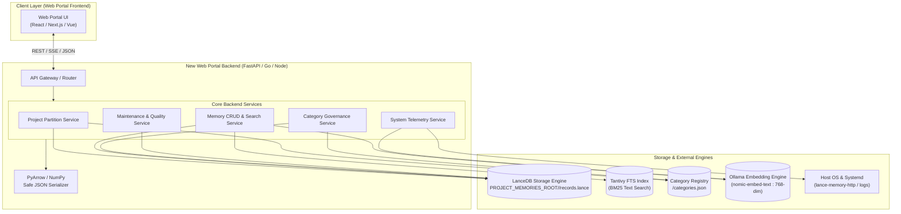

# Lance Memory Web Portal — Backend Requirements & Architecture Specification

## 1. Executive Summary & Purpose

The Lance Memory Web Portal is the operational control plane and administrative interface for **lance-memory** (lance-mem0ry) — an autonomous, project-partitioned engineering memory system utilized by AI coding agents and human engineers.

### Why Redesign the Web Portal Backend?
The initial administration panel was implemented in **Streamlit** (`admin_app.py`). While effective for rapid prototyping, Streamlit has significant architectural constraints:
1. **Monolithic In-Process Execution**: UI state and backend queries run in the same Python process, blocking UI responsiveness during heavy vector scans or batch embeddings.
2. **Coupled Concurrency**: Multiple users or browser tabs trigger reruns of the entire script, creating duplicate file handles and potential read/write conflicts against local LanceDB tables.
3. **Lack of a True API Layer**: Modern frontend frameworks (Next.js, React, Svelte, Vue) require a decoupled, stateless REST or WebSocket API with standardized JSON schemas, pagination, and error contracts.
4. **Serialization Pitfalls**: LanceDB stores high-dimensional vectors as NumPy/PyArrow `ndarray`s, which standard JSON libraries cannot serialize without specialized encoding layers.

This document outlines the **functional, architectural, and data contract requirements** for building a robust, decoupled backend for the Lance Memory Web Portal.

---

## 2. System Architecture Overview



---

## 3. Core Subsystems & Technical Requirements

### 3.1. LanceDB Storage Engine Interface
The backend must interface directly with **LanceDB** (embedded columnar vector database using Apache Arrow).

* **Directory Partitioning**:
  - Root: `$PROJECT_MEMORIES_ROOT` (e.g. `/opt/eh-stack/app/lance-memory/project_memories`).
  - Each project partition is an independent LanceDB dataset directory: `<PROJECT_MEMORIES_ROOT>/<project_id>/`.
  - Inside each project folder lives `records.lance`.
* **Record Schema**:
  Every record in the `records` table adheres to the following PyArrow / LanceDB schema:
  | Field | Type | Description |
  |---|---|---|
  | `record_id` (or `memory_id`) | String (UUID) | Unique primary key |
  | `project_id` | String | Enforced partition name (e.g. `MyProject`) |
  | `text` | String | The actual memory content, blueprint, or fact |
  | `vector` | FixedSizeList(Float32, 768) | Embedding vector generated by `nomic-embed-text` |
  | `category` | String | Approved category slug (e.g. `key_facts`, `api_reference`, `ongoing_tasks`) |
  | `bucket` | String | Semantic bucket: `fact`, `decision`, `state` |
  | `symbol` | String (max 120) | Code symbol, class, function, or API signature |
  | `entity_type` | String | `Rule`, `Directive`, `Preference`, `Hook`, `UI Element`, `Protocol`, `General` |
  | `source_type` | String | `agent`, `ast_index`, `human` |
  | `verified` | Boolean | `true` for ratified code/facts; `false` for WIP blueprints |
  | `importance` | Float32 | Priority weight (0.0 to 1.0) |
  | `decay_rate` | Float32 | Temporal memory decay rate |
  | `access_count` | Int64 | Counter incremented upon retrieval |
  | `last_accessed_at` | String (ISO-8601) | Timestamp of last recall |
  | `status` | String | Lifecycle state: `active`, `archived`, `deleted` |
  | `superseded_by` | String | UUID of successor memory when promoted/updated |
  | `tags` | List(String) | Categorical or provenance tags (e.g. `["redis", "oauth2", "v1-api"]`) |
  | `created_at` | String (ISO-8601) | Record creation timestamp |
  | `updated_at` | String (ISO-8601) | Record last update timestamp |

* **Search Engine Modes**:
  1. **Vector / Semantic Search**: Cosine distance similarity query using pre-computed 768-dim query vector (`tbl.search(query_vec).metric("cosine").limit(k)`).
  2. **Full-Text Search (FTS)**: Tantivy-backed BM25 keyword search (`tbl.search(query_text).limit(k)`).
  3. **Hybrid Search (Reciprocal Rank Fusion)**: Combines dense vector search with sparse FTS keyword search, normalizing ranks across both result sets.
  4. **SQL Predicate Filtering**: Pre-filtering or post-filtering on metadata fields (`where("status = 'active' AND category = 'key_facts'")`).
* **Concurrency & Indexing**:
  - LanceDB uses Multi-Version Concurrency Control (MVCC). Reads do not block writes, but concurrent batch writes should be serialized per project.
  - Tantivy FTS indices must be rebuilt or incrementally indexed after batch inserts (`tbl.create_fts_index("text", replace=True)`).

---

### 3.2. Embedding Engine Interface (Ollama)
The backend must interface with a local or remote Ollama instance (default: `http://127.0.0.1:11434`).

* **Model**: `nomic-embed-text` (768 dimensions).
* **Endpoints Used**:
  - `POST /api/embed`: Batch vectorization endpoint. Receives `{"model": "nomic-embed-text", "input": ["text 1", "text 2"]}` and returns `{"embeddings": [[...], [...]]}`.
  - `GET /api/tags`: Model availability probe. Verifies that `nomic-embed-text` is loaded and ready.
* **Why Required**:
  - New memories submitted via the web portal require immediate vectorization.
  - Semantic and hybrid search queries require on-the-fly vectorization of the search term.
  - Duplicate detection scans compare vector cosine distances.

---

### 3.3. Category Governance & Registry Subsystem
Categories are strictly governed to prevent agents and users from polluting memory partitions with arbitrary strings.

* **Storage**: `<PROJECT_MEMORIES_ROOT>/<project_id>/categories.json`
* **Data Structure**:
  ```json
  {
    "key_facts": {
      "description": "Ratified facts, verified patterns, stable APIs, and configuration constants.",
      "bucket": "fact"
    },
    "architectural_decisions": {
      "description": "System architecture, design choices, invariants, patterns, and trade-offs.",
      "bucket": "decision"
    },
    "ongoing_tasks": {
      "description": "WIP blueprints, hypotheses, and pending implementation steps.",
      "bucket": "state"
    },
    "session_handoff": {
      "description": "Session summaries, milestones reached, and next action items.",
      "bucket": "state"
    }
  }
  ```
* **Required Backend Operations**:
  1. **List Categories**: Return all categories for a project with record counts per category.
  2. **Create / Update Category**: Add a new category with mandatory `description` and `bucket` (`fact`, `decision`, `state`).
  3. **Rename Category**: Update `categories.json` AND execute a bulk SQL update in LanceDB:
     `UPDATE records SET category = :new_cat WHERE category = :old_cat`
  4. **Delete Category**: Check if any active records use this category; if none (or if forced), remove from `categories.json`.
  5. **Cross-Project Category Migration / Copy Tool**:
     - Extract all records where `category = :source_cat` from `source_project`.
     - Update each record's `project_id` to `target_project`, append provenance tags (e.g. `migrated_from:<source_project>`).
     - Insert into `target_project` LanceDB table.
     - Copy the category definition into `target_project`'s `categories.json`.
     - If mode is `move`: delete matching records from `source_project`.
     - Rebuild FTS indices on both tables.

---

### 3.4. Project Partition Lifecycle Subsystem
Partitions isolate distinct applications, bots, or codebases (e.g. `ProjectA`, `ProjectB`).

* **Dynamic Discovery**: The backend must scan `$PROJECT_MEMORIES_ROOT` for directories containing a valid `records.lance` dataset.
* **Provisioning Workflow**:
  1. Validate project name (`^[A-Za-z0-9][A-Za-z0-9._-]{0,127}$`).
  2. Create directory: `<PROJECT_MEMORIES_ROOT>/<new_project>/`.
  3. Initialize empty LanceDB table with the `ArchitecturalMemory` schema.
  4. Initialize Tantivy FTS index.
  5. Seed default `categories.json` (`key_facts`, `architectural_decisions`, `ongoing_tasks`, `session_handoff`).
* **Decommissioning & Purging**:
  - **Backup Snapshot**: Before purging, create an archive: `<PROJECT_MEMORIES_ROOT>_archive/<project>_backup_<timestamp>.tar.gz`.
  - **Purge / Delete**: Delete directory from disk only after explicit confirmation (`confirm=true`).

---

### 3.5. Maintenance & Quality Intelligence
The backend must run offline or on-demand data health routines:

* **Vector Deduplication Scan**:
  - Retrieve all `active` memories in a partition.
  - Calculate pairwise cosine distance between vectors:
    $$\text{dist}(u, v) = 1 - \frac{u \cdot v}{\|u\|_2 \|v\|_2}$$
  - Flag any pairs where $\text{dist} < 0.15$ (near-identical semantic duplicates).
  - Return the duplicate candidates to the frontend for merge or archiving.
* **Mem0 Rules & Directives Filtering**:
  - Specialized filtering on `entity_type IN ('Rule', 'Directive', 'Preference', 'Hook')`.
  - Displays behavioral constraints and instructions currently taught to agents.
* **Token Estimation & Context-Packing Lab**:
  - Simulate how many memory tokens a query injects into an agent's prompt.
  - Tokenizer approximation: `len(text) / 4` (or exact tiktoken / cl100k_base count).

---

### 3.6. System Telemetry & Service Health
The backend provides host and process telemetry to the web portal:

* **Systemd Service Probes**:
  - Status of `lance-memory-http.service` (FastMCP port 8768)
  - Status of `lance-memory-admin.service`
  - Status of `cockpit.socket` (port 9090)
* **Log Streamer**:
  - Query recent journal logs via `journalctl -u lance-memory-http.service -n 100 --no-pager`.
* **Storage Telemetry**:
  - Disk space consumed per project partition.
  - Total records, active records, archived records, and vector index size.

---

## 4. Data Serialization & Vector Formatting Rules

### The `ndarray` Serialization Problem
In Python and Arrow-based backends, reading vector columns yields NumPy arrays (`np.ndarray`). Standard JSON encoders fail with:
`TypeError: Object of type ndarray is not JSON serializable`

### Backend Serialization Requirements
1. **Summary / Grid View Endpoints**:
   - The `vector` column (768 floats per record) should **NOT** be returned in list/grid views. It consumes massive bandwidth and memory. Strip or exclude `vector` when querying memory catalogs.
2. **Detail / Export Endpoints**:
   - When raw vector export is requested (e.g. JSON export for backups), vectors MUST be explicitly converted: `vector.tolist()` or encoded via a custom JSON encoder (`NumpyEncoder`).
3. **Timestamp Standardization**:
   - All dates (`created_at`, `updated_at`, `last_accessed_at`) must serialize as ISO-8601 UTC strings (`YYYY-MM-DDTHH:MM:SSZ`).

---

## 5. REST API Specification

A redesigned backend should expose the following standardized RESTful endpoints:

### Projects (`/api/v1/projects`)
* `GET /api/v1/projects` — List all discovered project partitions with total row counts and status.
* `POST /api/v1/projects` — Provision a new project partition (`{"name": "NewProject"}`).
* `GET /api/v1/projects/{project_id}` — Get summary statistics, disk usage, and health for a partition.
* `DELETE /api/v1/projects/{project_id}` — Purge partition (requires `{"confirm": true, "backup": true}`).

### Categories (`/api/v1/projects/{project_id}/categories`)
* `GET /api/v1/projects/{project_id}/categories` — List all categories, descriptions, buckets, and record counts.
* `POST /api/v1/projects/{project_id}/categories` — Create or update a category (`{"name": "...", "description": "...", "bucket": "fact"}`).
* `PATCH /api/v1/projects/{project_id}/categories/{cat_name}` — Rename category and cascade-update records.
* `DELETE /api/v1/projects/{project_id}/categories/{cat_name}` — Delete category if unused.
* `POST /api/v1/projects/{project_id}/categories/migrate` — Copy or move category to another project (`{"target_project": "...", "category": "...", "mode": "copy"|"move"}`).

### Memories (`/api/v1/projects/{project_id}/memories`)
* `GET /api/v1/projects/{project_id}/memories` — Paginated list of memories with filters (`category`, `bucket`, `status`, `verified`, `limit`, `offset`). Omits vector data by default.
* `POST /api/v1/projects/{project_id}/memories` — Ingest single or batch memories (automatically calls Ollama for embeddings).
* `GET /api/v1/projects/{project_id}/memories/{memory_id}` — Get full memory record (including vector if requested).
* `PATCH /api/v1/projects/{project_id}/memories/{memory_id}` — Update memory text, category, or status (`active`, `archived`, `deleted`). Re-embeds if text changed.
* `DELETE /api/v1/projects/{project_id}/memories/{memory_id}` — Soft-delete (`status='deleted'`) or hard purge.

### Search (`/api/v1/projects/{project_id}/search`)
* `POST /api/v1/projects/{project_id}/search`
  - Request: `{"query": "...", "mode": "hybrid"|"vector"|"fts", "category": "...", "limit": 10}`
  - Response: Array of scored memory objects with similarity scores and highlight snippets.

### Maintenance & Telemetry (`/api/v1/telemetry`)
* `GET /api/v1/telemetry/health` — Host services status, Ollama connection, FastMCP status.
* `GET /api/v1/telemetry/logs?lines=100` — Recent systemd journal logs.
* `GET /api/v1/projects/{project_id}/duplicates?threshold=0.15` — List candidate duplicate pairs.
* `POST /api/v1/projects/{project_id}/reindex` — Rebuild Tantivy FTS index.

---

## 6. Recommended Implementation Stack

For a clean, high-performance redesign of the web portal backend:

| Layer | Recommended Technology | Rationale |
|---|---|---|
| **Backend Framework** | **FastAPI** (Python 3.12+) or **Go** | FastAPI has native first-class support for LanceDB and PyArrow, automatic OpenAPI (Swagger) documentation, and Pydantic validation. Go is also viable using Lance Go bindings. |
| **Vector Database Engine** | **LanceDB** (`lancedb` + `pyarrow`) | Retains 100% binary compatibility with existing `records.lance` files without needing data migration. |
| **Data Validation** | **Pydantic v2** | Enforces strict schemas for memory records, category registries, and API inputs. |
| **Embedding Client** | **HTTPX / Requests** | Async client to communicate with local Ollama (`/api/embed`). |
| **Frontend Framework** | **Next.js / React** or **Vite + TailwindCSS** | Clean modern SPA or SSR frontend consuming the REST API, completely decoupled from the data storage layer. |

---

## 7. Security & Concurrency Considerations

1. **Process Isolation**: The Web Portal Backend must run as its own dedicated service (e.g. `lance-memory-api.service`) listening on a designated port (e.g. `8766`).
2. **Network Scoping**: By default, bind to LAN or loopback (`127.0.0.1` or LAN `192.168.1.0/24`) with UFW firewall protection.
3. **LanceDB Multi-Process Safety**: LanceDB supports concurrent readers and serialized writers via Arrow file versions. However, the backend should use a file-lock or in-memory mutex when executing destructive partition operations (such as table recreation or full-table deletion) to prevent conflicts with the FastMCP server.
4. **Automated Rollback Safeguards**: Any destructive endpoint (`purge`, `delete_partition`) MUST automatically trigger a tarball backup before unlinking data.
